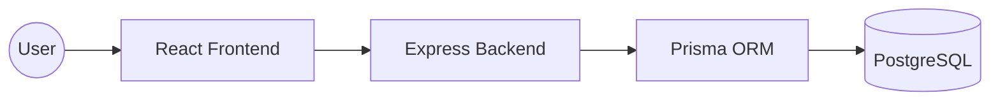

# 🚀 TaskFlow &mdash; Modern Task Management System

**TaskFlow** is a premium, full-stack task management application designed for efficiency and visual excellence. Built as part of a Full Stack Development Internship assessment, it demonstrates a robust integration of modern web technologies, persistent data storage, and a professional-grade dark-themed UI.

---

## ✨ Features

- **End-to-End CRUD**: Seamlessly Create, Read, Update status, and Delete tasks.
- **Premium Dark UI**: A state-of-the-art interface built with **Tailwind CSS 4**, featuring glassmorphism, smooth animations, and a curated color palette.
- **Persistent Storage**: Fully integrated with **Supabase (PostgreSQL)** for reliable data storage.
- **Responsive Design**: Fully optimized for mobile, tablet, and desktop viewing.
- **Real-time Updates**: Instant state management using React hooks for a fluid user experience.

---

## 🛠️ Technical Stack

### **Frontend**
- **React 19**: Modern UI library with the latest efficiency improvements.
- **Tailwind CSS 4**: Next-gen utility-first styling for a premium aesthetic.
- **Lucide Icons**: Clean, light-weight iconography.
- **Axios**: Robust HTTP client for API communication.

### **Backend**
- **Node.js & Express**: High-performance RESTful API server.
- **TypeScript**: Ensuring type-safety and developer productivity.
- **Prisma 7**: Advanced ORM using the latest Query Compiler and Driver Adapters for maximum speed.
- **PostgreSQL**: Industry-standard relational database hosted on Supabase.

---

## 🌐 Live Demo & Deployment

| Component | URL | Provider |
| :--- | :--- | :--- |
| **Frontend App** | [Live Link](https://taskmanagement-ruddy.vercel.app) | **Vercel** |
| **Backend API** | [API Gateway](https://taskmanagement-5yfy.onrender.com/api/tasks) | **Render** |

---

## 🚀 Quick Start (Local Setup)

### **Backend**
1. Navigate to the folder: `cd backend`
2. Install dependencies: `npm install`
3. Configure Environment: Create a `.env` file with your `DATABASE_URL`.
4. Run migrations: `npx prisma db push`
5. Start server: `npm run dev`

### **Frontend**
1. Navigate to the folder: `cd frontend`
2. Install dependencies: `npm install`
3. Configuration: Create a `.env` file with `VITE_API_URL=http://localhost:5000/api`.
4. Start App: `npm run dev`

---

## 🏗️ Architecture Overview

The system follows a classic client-server architecture. The **React Frontend** communicates via **REST APIs** with the **Express Backend**, which utilizes the **Prisma ORM** to interact with a cloud-hosted **PostgreSQL** database. 

---

## 🧑‍💻 Author
**Shubham Varshney**  
*Full Stack Development Intern Assessment*
